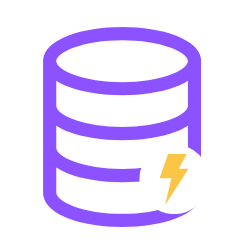
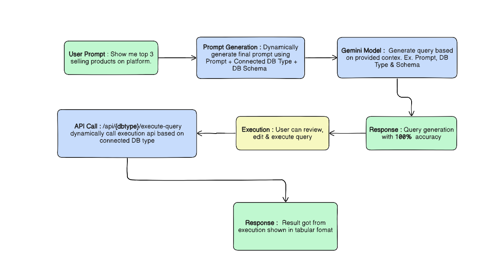

#  Talk2DB

**Talk2DB** is a smart, AI-powered automation tool built with **Next.js** that lets users interact with databases using **natural language** instead of complex queries.  
Simply type prompts like:

> “Show all users who published blogs”

and Talk2DB = will automatically send User Promt + Connected DB's type + Schema to generate the corresponding database query, highlight it for review, and execute it safely — showing the results in a structured table.

---

## 🚀 Features

- 💬 **Natural Language Querying** – Type what you want in plain English.
- 🧠 **AI-Powered Query Generation** – Automatically converts your prompt into a valid database query.
- 🔒 **Safe Execution Layer** – Only allows read-only operations.
- 🗄️ **My SQL Integration** – Connect your My SQL database easily.
- 🗄️ **MongoDB Integration** – Connect your MongoDB database easily.
- ⚙️ **Future-Ready** – MySQL and other database support planned.
- 🧾 **Visual Output** – See results in a clean, tabular format.
- 🧍‍♂️ **User-Controlled** – Review and run queries manually before execution.

---

---

## ⚙️ How It Works



---

## 📁 Project Structure

```bash
project-root/
├── app/                         # App source code
│   ├── api/
│   │   ├── gemini/              # Generate query
│   │   ├── mongodb/             # Fetch schema & execute Mongo queries (MQL)
│   │   └── mysql/               # Fetch schema & execute SQL queries
│   ├── components/              # Reusable UI components
│   ├── connect/                 # Database connection pages
│   └── quick-guide/             # Quick-guide page
├── lib/                         # Firebase configuration
├── public/                      # Static files
├── redux-store/                 # Dynamic state handling (authentication, DB Connection, Query)
├── utilis/                      # Raw database schema compression
├── package.json                 # Dependencies & scripts
└── README.md                    # Project documentation

```

---

## 🔒 Security

Talk2DB ensures all database operations are **read-only**.  
It blocks any write, update, or delete queries.

---

# UNDER DEVELOPEMENT 🧑‍💻...
